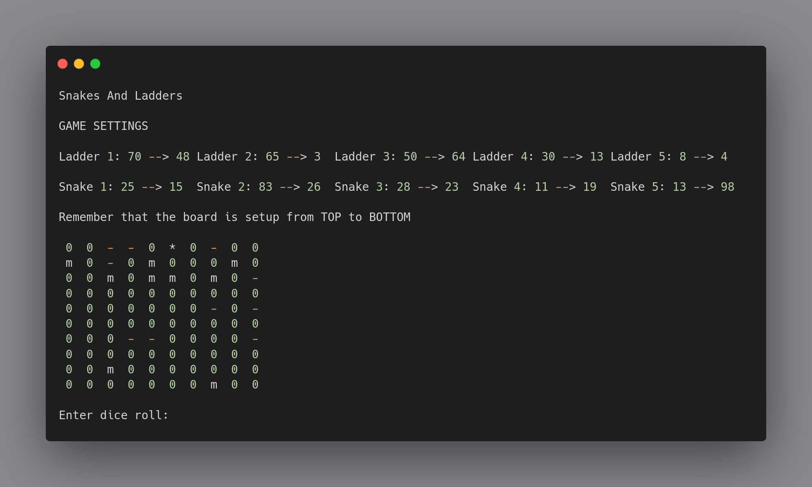

# Snakes and Ladders
### Language: C
### Status: Under Development

This is a simple program of Snakes and Ladders, written in the C Programming Language. It uses only the standard library, and is therefore portable to any system with a C compiler.

### Progress:
- [x] Display Board
- [ ] Snakes
- [ ] Ladders
- [x] One Player
- [x] Reload Board
- [ ] Two Players
- [ ] Random Dice
- [x] Win Condition
- [x] Menu
- [ ] Save Game
- [ ] Load Game

### How to Play:
1. Compile the program using `gcc main.c -o main`
2. Run the program using `./main`
3. Follow the instructions on the screen

### How to Contribute:
1. Fork the repository
2. Make your changes
3. Create a pull request

